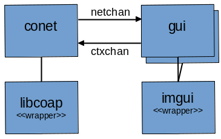

Cotel is based on a straightforward and flexible architecture to separate back end networking from the user interface, as shown in the diagram below.

# conet Networking
The *conet* module provides CoAP networking networking for the enclosing GUI context. conet uses the *libcoap* wrapper module to access libcoap functionality. The conet module runs in its own thread, and uses libcoap's socket networking capabilities to send and receive CoAP packets.

# gui User Interface
The *gui* module provides the user interface, as shown in the [example screenshot](./screenshot.png). The UI uses a separate module per window, like *gui_client* to generate a CoAP client request. The UI operates in the main application thread, and uses the *imgui* wrapper module to access the Dear Imgui library.

# Channel communication
Cotel uses Nim's channel facility to tranfer data messages between the UI and networking threads. *netchan* sends messages from the conet module to gui, and *ctxchan* sends messages from gui to conet. These channels safely transfer messages between the threads, which eliminates the usual locking and syncing concerns for an application developer. Both the conet and gui modules run an event loop, within which they check for an incoming channel message.